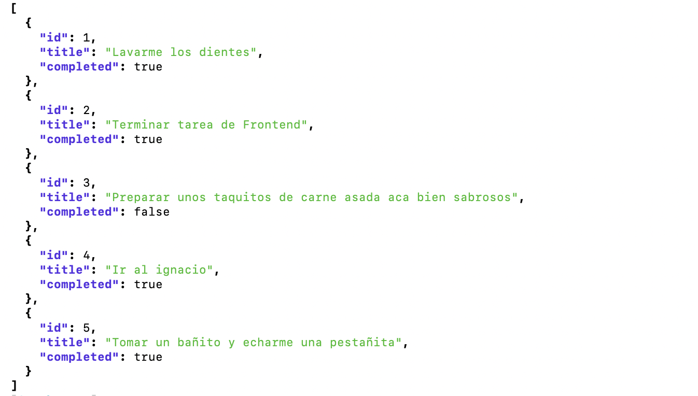

#Task Manager - Backend
RESTful API contruida con [Go](https://go.dev/), encargada de manejar peticiones HTTP para obtener, editar o eliminar tareas.

## Tecnologías Utilizadas

- **Lenguaje:** Go
- **Despliegue:** Github Pages

## Requisitos Previos

Para poder ejecutar el proyecto en tu entorno local, asegúrate de tener instalado:

- [Go](https://go.dev/dl/) (1.26.0+)

## Clona el repositorio:

```Bash
git clone https://github.com/Naraka28/TaskApi.git
cd TaskApi
```

## Ejecucion de la Aplicacion

Para levantar la API debemos utilizar el siguiente comando, el servidor se levantara en http://localhost:3000

```bash
go run main.go
```

## Enlace del proyecto

[TaskApi](https://taskapi-pjm5.onrender.com/tasks)

## Vista Previa


